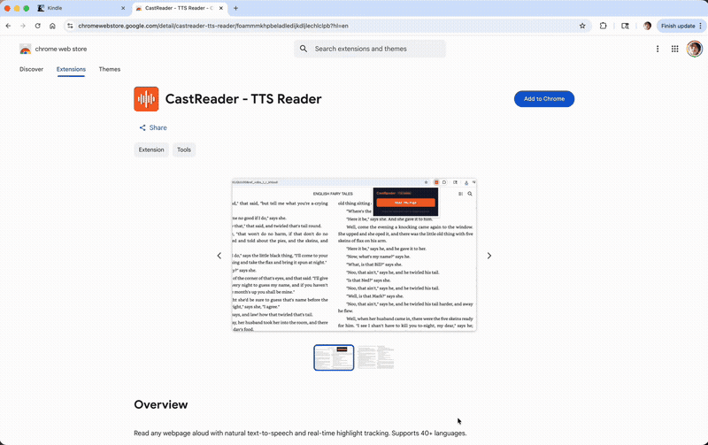
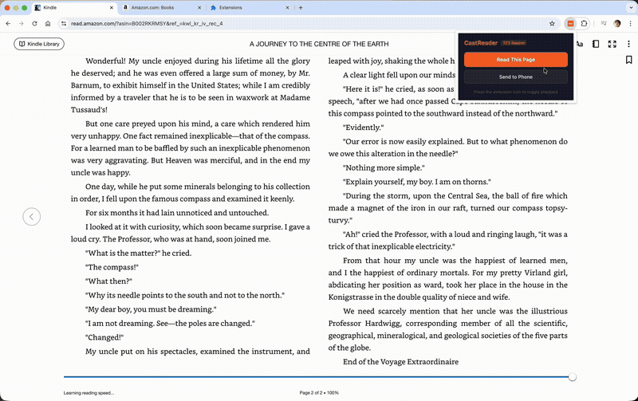

# CastReader — Free Text to Speech Chrome Extension

**The only Chrome extension that reads Kindle Cloud Reader books aloud.** No other TTS tool works on Kindle — Speechify, NaturalReader, and Read Aloud all fail. CastReader uses OCR to extract text from Kindle's encrypted font rendering, something no other extension can do.

### Text to Speech with Real-Time Highlighting


### Send to Phone — Kindle Books as Audiobooks


## Why CastReader?

Every TTS extension fails on Kindle Cloud Reader because Amazon encrypts text into custom font glyphs rendered as images. CastReader is the only tool that solves this:

1. Intercepts Kindle's render pipeline to capture layout data
2. Runs tesseract-wasm OCR to extract text with word-level bounding boxes
3. Generates natural speech with Kokoro TTS engine
4. Syncs word-level highlight to audio playback in real time

This same approach works on WeRead (微信读书), which renders text on Canvas — another platform where every other TTS tool fails.

## Features

### Kindle Text to Speech
- Works on **every** Kindle book in Kindle Cloud Reader (read.amazon.com)
- OCR-based extraction bypasses Amazon's font encryption
- Word-level highlight synced to audio
- Automatic page turning

### Send to Phone
- One tap to send an entire Kindle or WeRead book to your phone
- Listen as an audiobook — no Audible subscription needed
- Works via Telegram — no extra app required
- Auto-turns pages and syncs chapters in real time

### Universal Text to Speech
- **15+ site-specific extractors**: Notion, Google Docs, arXiv, Medium, Substack, ChatGPT, Claude, Gemini, and more
- **Universal extraction**: Readability-based algorithm works on any webpage
- **Paragraph highlighting**: Real-time visual tracking as you listen
- **Smart content detection**: Skips navigation, ads, and boilerplate

### Free, No Limits
- 40+ languages with automatic detection
- No signup, no account, no subscription
- No usage limits — read as much as you want
- No data collection — all processing happens locally

## Install

| Browser | Link |
|---------|------|
| Chrome | [Chrome Web Store](https://chromewebstore.google.com/detail/castreader-free-text-to-s/fijkdlgaoigopbjanlbejkpfadpokhca) |
| Edge | [Edge Add-ons](https://microsoftedge.microsoft.com/addons/detail/castreader-free-text-to/ncbhfcbapodamjgnkhccgjkahfnlkdlm) |
| Firefox | [Firefox Add-ons](https://addons.mozilla.org/firefox/addon/castreader/) |

## How It Works

```
You open a Kindle book in your browser
  → CastReader extracts text (OCR for Kindle, DOM for regular pages)
  → Kokoro TTS generates natural speech
  → Audio plays with real-time paragraph + word highlighting
  → "Send to Phone" syncs the entire book to your phone as an audiobook
```

## Supported Platforms

| Platform | Method | Status |
|----------|--------|--------|
| **Kindle Cloud Reader** | tesseract-wasm OCR + render interception | ✅ Full support |
| **WeRead (微信读书)** | Canvas text extraction via fetch interception | ✅ Full support |
| Notion | DOM extraction | ✅ |
| Google Docs | DOM extraction | ✅ |
| arXiv | DOM extraction | ✅ |
| Medium / Substack | DOM extraction | ✅ |
| ChatGPT / Claude / Gemini | DOM extraction | ✅ |
| Any webpage | Readability + heuristic extraction | ✅ |

## FAQ

**Why don't other TTS extensions work on Kindle?**
Amazon renders Kindle text using encrypted custom fonts — the actual characters in the DOM are scrambled. Standard DOM-based text extraction gets gibberish. CastReader uses OCR on the rendered page images to get the real text.

**Is this legal?**
CastReader is an accessibility tool. It reads aloud content you've already purchased, similar to your phone's built-in screen reader. No content is downloaded or redistributed.

**How does Send to Phone work?**
Click "Send to Phone" in the extension popup. CastReader syncs the book chapter by chapter to a web player accessible on your phone. It auto-turns pages on desktop and streams content in real time.

**Do I need Audible?**
No. CastReader generates speech from the text of books you already own in your Kindle library. No Audible subscription needed.

**Is it really free?**
Yes. No freemium tier, no monthly limits, no account required. CastReader uses the open-source Kokoro TTS engine which runs on our server at no per-request cost.

## Links

- [Website](https://castreader.ai)
- [Listen to Kindle](https://castreader.ai/listen-to-kindle) — How Kindle TTS works
- [Send to Phone](https://castreader.ai/send-to-phone) — Desktop to phone audiobook streaming
- [Blog](https://castreader.ai/blog) — Guides and tutorials

## License

MIT
